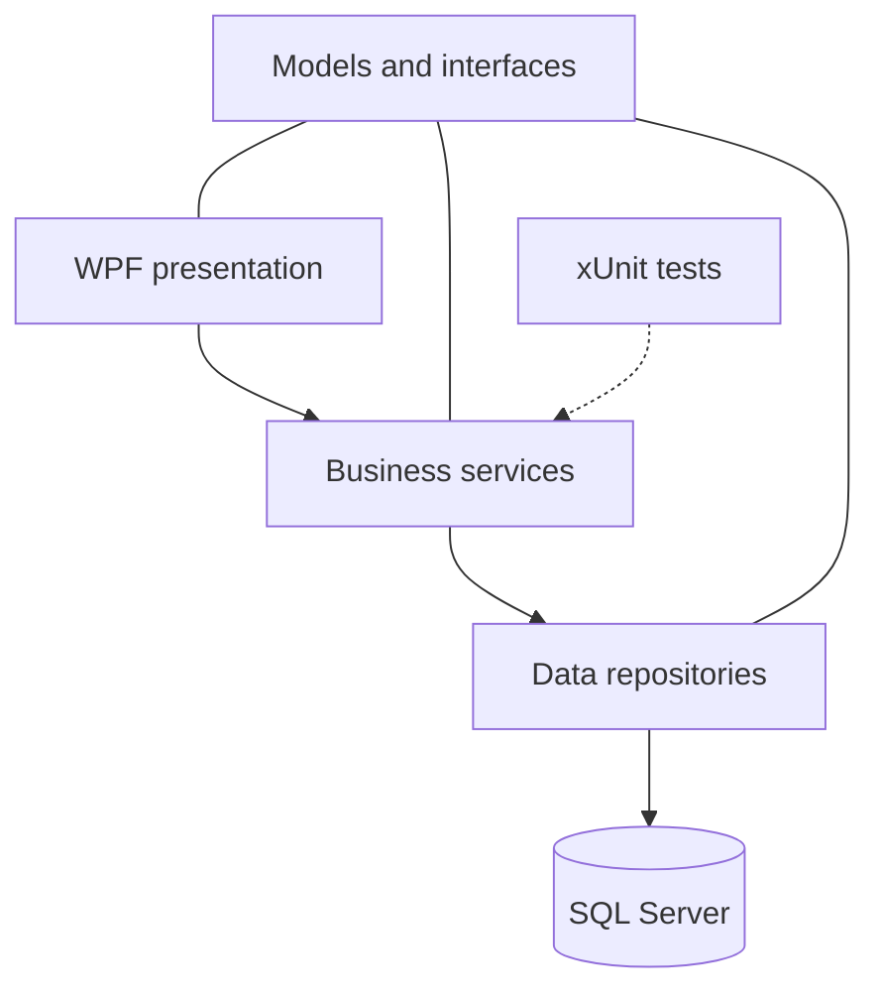

# Inventory Management System

A Windows desktop inventory application built with **C#**, **.NET 8**, **WPF**, **MVVM**, and **SQL Server**. The project demonstrates a layered architecture with dependency injection, asynchronous data access, stored procedures, validation, password hashing, and unit testing.


## Project Overview

The system provides a foundation for managing inventory data through a modern WPF interface. Its current implementation focuses on user authentication, products, categories, suppliers used by product records, and the separation of presentation, business, model, and data-access responsibilities.

> [!NOTE]
> This repository is an active development version. Products and categories are currently connected to the application workflow. Dashboard, full supplier management, inventory logs, reports, and settings appear in the navigation and are planned for further implementation.

## Current Features

| Area | Current implementation |
|---|---|
| Authentication | User registration and sign-in using email and password |
| Password security | Password hashing and verification with BCrypt |
| User roles | Role information is stored and displayed for the signed-in user |
| Products | View and add products with SKU, stock, prices, category, supplier, image, and description |
| Categories | View and add product categories |
| Suppliers | Supplier records are retrieved for product creation |
| Validation | Input validation through MVVM data annotations |
| Data access | Asynchronous SQL Server access using ADO.NET, Dapper, and stored procedures |
| Application setup | Dependency injection and configuration through the .NET Generic Host |
| Testing | xUnit and Moq tests for user-service validation and repository outcomes |

## Architecture



| Layer | Responsibility |
|---|---|
| Presentation Layer | WPF views, MVVM view models, navigation, validation, and user interaction |
| Business Layer | Application services and business validation |
| Data Access Layer | Repository implementations, SQL connections, Dapper, ADO.NET, and stored-procedure calls |
| Model | DTOs and shared service/repository interfaces |
| Tests | Unit tests for business-layer behavior |

## Technologies

- C# and .NET 8
- WPF
- MVVM with CommunityToolkit.Mvvm
- Microsoft.Extensions.Hosting and dependency injection
- SQL Server and T-SQL stored procedures
- Microsoft.Data.SqlClient and Dapper
- BCrypt.Net-Next
- xUnit, Moq, and Coverlet
- Extended WPF Toolkit and MahApps.Metro.IconPacks

## Repository Structure

```text
.
├── DataBase/
│   └── InventoryDB
└── Inventory Management System/
    ├── InventoryManagementSystem_PresentaionLayer/
    ├── InventoryManagementSystem_BusinessLayer/
    ├── InventoryManagementSystem_DataAccessLayer/
    ├── InventoryManagementSystem_Model/
    └── InventoryManagementSystem.Tests/
```

> [!IMPORTANT]
> `PresentaionLayer` is the existing project-directory name in the repository and is intentionally shown exactly as it appears.

## Prerequisites

Before running the application, install:

- Windows 10 or Windows 11
- Visual Studio 2022 with the **.NET desktop development** workload
- .NET 8 SDK
- SQL Server
- SQL Server Management Studio (SSMS)
- Git

## Installation

### 1. Clone the repository

```bash
git clone https://github.com/ZaidAlhassnawi/Inventory-Management-System.git
cd Inventory-Management-System
```

### 2. Restore the database

1. Open SQL Server Management Studio.
2. Connect to your local SQL Server instance.
3. Restore the database using the included `DataBase/InventoryDB` file.
4. Set the destination database name to `InventoryDB`.
5. Confirm that the tables and stored procedures were restored successfully.

If the SSMS file picker does not display the file because it has no extension, change the filter to show all files.

### 3. Configure the connection string

Open:

```text
Inventory Management System/InventoryManagementSystem_DataAccessLayer/appsettings.json
```

For Windows Authentication, use a connection string similar to:

```json
{
  "ConnectionStrings": {
    "DBConnectionString": "Server=.;Database=InventoryDB;Trusted_Connection=True;Encrypt=False;TrustServerCertificate=True;"
  }
}
```

For SQL Server Authentication:

```json
{
  "ConnectionStrings": {
    "DBConnectionString": "Server=localhost;Database=InventoryDB;User Id=YOUR_SQL_USER;Password=YOUR_SQL_PASSWORD;Encrypt=False;TrustServerCertificate=True;"
  }
}
```

> [!WARNING]
> Never commit real database usernames or passwords. Use local configuration, user secrets, or environment variables for sensitive values.

### 4. Open and run the solution

Open the following solution in Visual Studio:

```text
Inventory Management System/InventoryManagementSystem_PresentaionLayer/InventoryManagementSystem_PresentaionLayer.sln
```

Then:

1. Restore NuGet packages.
2. Set `InventoryManagementSystem_PresentaionLayer` as the startup project.
3. Build the solution.
4. Run the application.

You can also build from the command line:

```bash
dotnet restore "Inventory Management System/InventoryManagementSystem_PresentaionLayer/InventoryManagementSystem_PresentaionLayer.sln"
dotnet build "Inventory Management System/InventoryManagementSystem_PresentaionLayer/InventoryManagementSystem_PresentaionLayer.sln"
```

## Running the Tests

Run the test project with:

```bash
dotnet test "Inventory Management System/InventoryManagementSystem.Tests/InventoryManagementSystem.Tests.csproj"
```

## Basic Workflow

1. Restore the database and configure the connection string.
2. Start the application.
3. Create an account from the sign-up screen or sign in with an existing account.
4. Add or review categories.
5. Open Products and add a product.
6. Enter its SKU, stock, cost price, selling price, category, supplier, and optional image or description.

## Database Notes

The application expects a SQL Server database named `InventoryDB` and uses stored procedures including:

- `SP_AddNewUser`
- `SP_GetUserByUserNameAndPassword`
- `SP_Products_Insert`
- `SP_Products_GetAll`
- `SP_Categories_Insert`
- `SP_Categories_GetAll`
- `SP_Suppliers_GetAll`

Product images are copied at runtime to a local `ProductImages` directory, while the relative image path is stored with the product record.

## Planned Development

- Complete dashboard metrics
- Complete supplier-management screens
- Add stock-in and stock-out workflows
- Add inventory activity logs
- Add reports and export options
- Complete settings and user-management screens
- Expand automated test coverage
- Move sensitive configuration outside tracked files

## Author

**Zaid Al-Hassnawi**

- GitHub: [ZaidAlhassnawi](https://github.com/ZaidAlhassnawi)
- LinkedIn: [zaid-alhassnawi](https://www.linkedin.com/in/zaid-alhassnawi/)

## Feedback

Suggestions and constructive feedback are welcome. You can open an issue in this repository to report a problem or propose an improvement.
